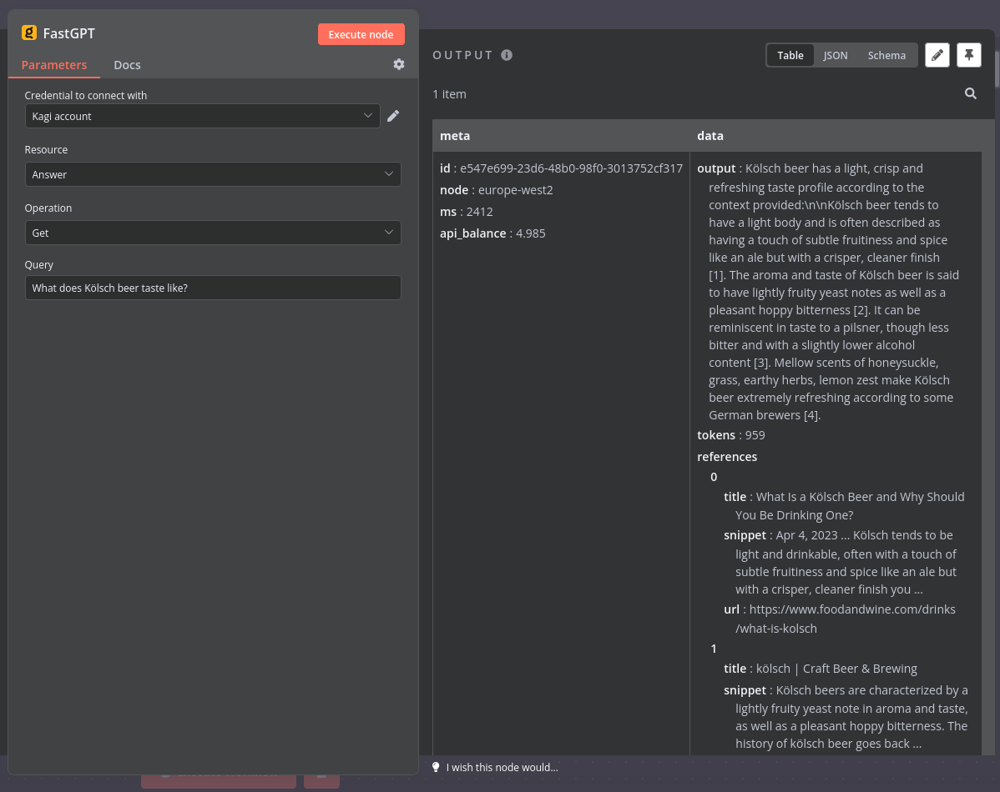

# n8n-nodes-fastgpt

This n8n community node allows querying [FastGPT by Kagi](https://help.kagi.com/kagi/api/fastgpt.html).

## Screenshot

## Installation

* [Installation guide](https://docs.n8n.io/integrations/community-nodes/installation/) for n8n community nodes
* Enter `n8n-nodes-fastgpt` when n8n asks for the package name to install
* Get your API token here on [kagi.com](https://kagi.com/settings?p=api)

## Changelog

### 0.1.0

Initial node version